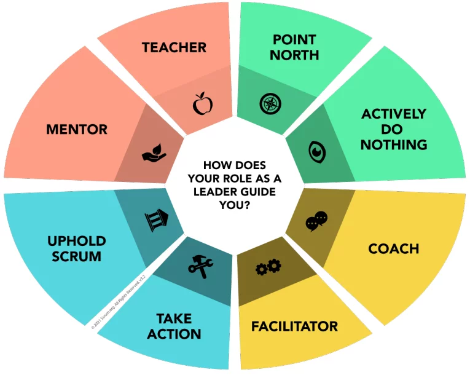

# Scrum Master

El _Scrum Master_ es responsable de establecer Scrum tal como se define en la [Guía de Scrum](https://scrumguides.org/docs/scrumguide/v2020/2020-Scrum-Guide-Spanish-European.pdf). Lo
consigue ayudando a todos a comprender la teoría y la práctica de Scrum, tanto **dentro del Equipo como en toda la organización**.

El **_Scrum Master_ es responsable de la efectividad del Scrum Team**. Lo logra al permitir que el equipo Scrum mejore sus prácticas, dentro del marco de Scrum.
Los _Scrum Masters_ son verdaderos líderes que sirven al equipo Scrum y a toda la organización.

El _Scrum Master_ sirve al equipo de Scrum de varias maneras, incluyendo:
* Capacitar a los miembros del equipo en autogestión y multifuncionalidad.
*  Ayudar al equipo de Scrum a centrarse en la creación de incrementos de alto valor que cumplan con la definición de hecho (`Definition of Done - DoD`).
* Promover la **eliminación de los impedimentos** para el progreso del equipo Scrum.
* Asegurar de **que todos los eventos de Scrum se lleven a cabo**, sean positivos, productivos y que se respete el tiempo establecido (time-box) para cada uno de ellos.

El _Scrum Master_ sirve al _Product Owner_ de varias maneras, incluyendo:
* Ayudar a encontrar técnicas para una definición eficaz de los objetivos del producto y la gestión de los retrasos en el producto.
* Ayudar al equipo de Scrum a comprender la **necesidad de elementos de trabajo pendiente de
productos claros y concisos**.
* Ayudar a establecer la planificación empírica de productos para un entorno complejo.
* Facilitar la **colaboración de las partes interesadas** según sea solicitado o necesario.

El _Scrum Master_ sirve a la organización de varias maneras, incluyendo:
* Liderar, capacitar y mentorizar a la organización en su adopción de Scrum.
* Planificar y asesorar sobre la implementación de Scrum dentro de la organización.
* Ayudar a las personas y a las partes interesadas a comprender y **promulgar un enfoque empírico para el trabajo complejo**.
* **Eliminar las barreras** entre las partes interesadas y los equipos de Scrum.

{:style="display:block; margin-left:auto; margin-right:auto"}
