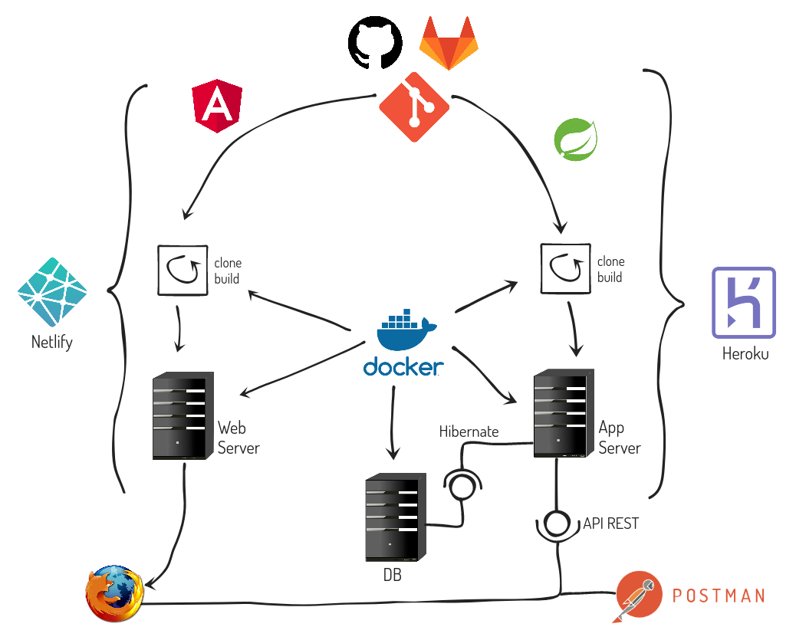

# Guión Dirección de Proyectos

Durante la asignatura vamos a crear un producto que sirva para la carga y explotación de datos deportivos. Éste es el supuesto:

> ### Especificación del sistema:  
> Se desea construir un sistema que permita la carga y explotación de datos deportivos. Se espera que el software desarrollado pueda estar accesible a través de múltiples dispositivos y plataformas... (ver [documento completo](https://16khs695mehu6grk1ykq.institutomilitar.com/Requisitos%20Datos%20Deportivos.docx))

También se deben conseguir más requisitos desde el [repositorio de github](https://github.com/DptoSIC/DatosDeportivos).

La toma de requisitos inicial se elabora en un [documento colaborativo](https://dim.institutomilitar.com/shared/9P92PaLz6AhzyvDEjlSGKhXVrD436hBXIbI1dcSB2Fh).

La generación del producto que aporta una solución se realiza en varias fases:
1. Concepto
   1. [Estudio de Viabilidad del Sistema (EVS)](https://es.wikipedia.org/wiki/An%C3%A1lisis_de_viabilidad) _¿Qué se puede hacer?_
   1. [Especificación de Requisitos de Software (ERS)](https://es.wikipedia.org/wiki/Especificaci%C3%B3n_de_requisitos_de_software) _¿Qué vamos a hacer?_
   1. Definición del [Producto Mínimo Viable (MVP)](https://es.wikipedia.org/wiki/Producto_viable_m%C3%ADnimo) _¿Qué mínimo valida nuestra solución?_
1. Preproducción (usaremos [Scrum](https://www.scrum.org/resources/what-is-scrum))
   1. Implementación (por incrementos) y aceptación MVP
   1. Despliegue en pruebas a petición del cliente
1. Producción (usaremos Scrum)
   1. Implementación producto completo (por incrementos)
   1. QA con el cliente en cada incremento
   1. Puesta en explotación a petición del cliente en cada incremento
1. Mantenimiento
   1. Correctivo y evolutivo
> _NOTA: Cuando se habla del cliente nos referimos a la persona que contrata o simplemente al responsable nombrado para el producto. Normalmente no coincide con el usuario principal del sistema_

## Estudio de Viabilidad del Sistema (EVS)
Partiendo del supuesto se obtendrán:
1. Los [**requisitos** detectados](https://dim.institutomilitar.com/shared/NIeUthgV0xdIKPlkK9CXDGS1bjnbN1aoU8O1nqVb18D),
1. [los **riesgos**](https://es.wikipedia.org/wiki/Riesgo) valorados (tanto en probabilidad de materializarse como daño sobre el sistema) y su aplicación en cada caso (puede que sea un riesgo sólo para una alternativa como desplegar en WAN-PG),
1. las **preguntas** que queden pendientes para aclarar (ver abajo) con los todos los [stackeholders](https://es.wikipedia.org/wiki/Parte_interesada_(empresas)) (cliente y usuarios en su caso) y
1. delimitar el objetivo inicial del estudio que debe responder a **¿Cuál es el MVP?**

> Otros conceptos relacionados son:
> 1. [Time to Market (TTM)](https://en.wikipedia.org/wiki/Time_to_market)
> 1. [Retorno de la Inversión (ROI)](https://en.wikipedia.org/wiki/Return_on_investment)

> _NOTA DIM: Es recomentable **hacer ya en este punto un borrador de Diagrama de Casos de Uso (CU) y de Modelo de Dominio**. No deben estar demasiado detallados ya que no son documentos de trabajo para implementación (puede que la alternativa escogida sea comprar una aplicación, pero sirven para analizar mejor alternativas de terceros y comprender bien el alcance del negocio y las relaciones entre actores, procesos y entidades. **Sobretodo son muy útiles inicialmente en nuestro caso ya que se ha observado en muchos alumnos que comprenden mejor sus proyectos individuales si pueden visualizar esta información**._

Es importante que las preguntas para aclarar contengan:
1. **Opciones** sobre las que tenga que decidir: _"Esto se puede hacer así o así"_ y **el cliente debe decidir**
1. **Implicaciones**, sobretodo en las preguntas que añadan esfuerzo: _"Si quiere que también tenga esta funcionalidad implicará X coste adicional y/o retrasar X tiempo la entrega y/o tener autorización de X, etc..."_. **De lo contrario el cliente siempre dirá que sí a un producto mayor**.
1. **Todo debe estar anotado**, no sólo por tener una guía a la hora de desarrollarse la reunión y tener una estructura coherente que no haga saltar de un tema a otro y volver, sino porque puede que la reunión no sea con todo el equipo y nuestro representante debe tener perfectamente claro el objetivo de la pregunta que se debe responder y la información que debe tener el cliente para tomar la decisión. Es deseable levantar un acta de la reunión y apuntar los asistentes ya que durante el desarrollo podrían cambiar los stackholders. En algunos órganos de desarrollo el acta se firma y pasa a formar parte de la documentación del proyecto
1. **Definir bien los términos usados**. Por ejemplo un evento tratado como histórico ¿Es un dato conseguido de una web donde se vuelca con X frecuencia o es cualquier partido finalizado por ejemplo? Dependiendo como se entienda no hay demasiada diferencia con tratarlo como un dato en vivo.
1. Para trabajar con el cliente **es útil la herramienta [Customer Journey](https://en.wikipedia.org/wiki/Customer_experience#Customer_journey_mapping)** (traducido como [mapa de experiencia del cliente](https://www.syndesis.mx/post/2017/01/08/mapa-de-la-experiencia-del-cliente)). Aunque como desarrolladores no es trabajo nuestro abarcar todas las etapas del viaje, sí que nos va a ayudar a conocer cuál será el usuario que usará la aplicación y qué experiencia debemos mejorar con respecto a la situación actual, priorizando las funcionalidades que tengan más impacto o nos aporten más información de cara a definir el MVP (ver [video de ejemplo](https://www.youtube.com/watch?v=PTk_KncCivE)).  

1. **Evitar ampliar el alcance** dando nuevas ideas ya que se trata de reducir la incertidumbre y definir el MVP

Se deben elaborar las alternativas que proporcionan una solución. Cada una con los siguientes puntos:
1. Definición de **arquitectura y tecnología** (de cada entorno en su caso)
1. **Estimación** de carga de trabajo y plazos de tiempo asociados
1. **Valoración económica** (mano de obra, hardware, software y servicios externos). Evidentemente debe ser coherente con la estimación
1. **Riesgos** valorados para la alternativa concreta. Debería haber una propuesta de evitarlo o reponerse ante su impacto
1. **Licenciamiento** de los distintos subsistemas que forman el producto. [Pueden venir impuestas](https://en.wikipedia.org/wiki/Comparison_of_free_and_open-source_software_licences) por las dependencias de cada solución. Si no es compatible debe añadirse el coste de la alternativa a cada subsistema en conflicto.
1. Cualquier otro aspecto específico con gran impacto en el desarrollo.

**Al final del EVS hay una reunión con el cliente donde se le plantean las alternativas** de solución acompañadas de una matriz de decisión ponderada sobre los aspectos relevantes desde el punto de vista del cliente (igual que la que se hace en el método de planeamiento táctico) **y debe elegir una o dirigir un nuevo estudio en otra dirección** si ninguna solución le parece adecuada.

Hay muchos ejemplos de EVS en los proyectos de otros años, aunque lo mejor no es coger una plantilla sino recoger lo que le puede interesar al cliente y pueda entendernos de la forma más rápida. Aquí un par de ejemplos de "presupuestos" reales con lo que le importa a un particular:
1. [Congreso UNIV](https://docs.google.com/document/d/1WEI_LBxhPK9PUz_uEud5FqiDURxhCbn_ycp-VknZucY/edit?usp=sharing): es un poco más formal y parecido al esquema de los proyectos DIM
1. [Mejora residencias](https://docs.google.com/document/d/1Q49rYm07qaMly1c7O5eQSKax10MJ9uj0lVh4b5Hkrnk/edit?usp=sharing): este va más al grano por el escaso plazo de tiempo y porque no estaba clara la financiación

> _NOTA: El formato para definir un requisito es:_  

| ID | Descripción | Prioridad | Fuente |
|---|:---|---|:---|
| Nº | Definición que deje claro la "DoD" | Se puede omitir si están ordenados | Enlace a documento o dónde defina qué persona lo ha incluido |
| 1 | Importar datos de football-data | Alta | [Doc 1](https://16khs695mehu6grk1ykq.institutomilitar.com/Requisitos%20Datos%20Deportivos.docx) |
| 2 | Basado en tecnología serverless para ahorrar costes iniciales | Media | [Doc 2](https://github.com/DptoSIC/DatosDeportivos) |  

## Especificación de Requisitos de Software (ERS)
En este punto se parte de un objetivo de solución global y se establecen las bases de los requisitos fundamentales. Los artefactos con los que vamos a trabajar son:
1. El diagrama de **Casos de Uso (CU)** y el **Modelo de Dominio** nos pueden servir para trabajar con el cliente clarificando aspectos importantes que son dificiles de ver en texto y se ven mejor en los diagramas
1. El **Diseño de la Interfaz de Usuario** (interfaces comunes - inicialmente dirigidas al MVP). Es un **documento importantísimo y con el que el cliente nos va a dar mayor feedback**. Para crearlos se pueden usar técnicas de Design Thinking como el wireframe  
  
Para ello se pueden usar [herramientas de mockeo](https://blogs.systweak.com/best-mockup-software-and-wireframe-tools/) o simplemente papel y boli. Para tomar decisiones mejor informadas se pueden usar técnicas como los [test A/B](https://es.wikipedia.org/wiki/Prueba_A/B). Es **imprescindible que permita la funcionalidad prevista para el MVP** (de nada sirve tener muchas pantallas si al menos una no hace lo que se ha pedido).
1. Definición y establecimiento de **entornos** (pruebas y producción - _ver punto preproducción_) en su caso
1. Solicitud/contrato de servicios externos necesarios para los distintos entornos. La finalidad de empezar con esto es ganar tiempo empezando cuanto antes. En MINISDEF ahora mismo se necesita hacer solicitud del **Anexo IV de la IT 01/2020 de CESTIC**.

Con ello se elabora la lista de requisitos para la alternativa escogida (ya que no todas pueden tener los mismos y además sabemos que es un producto vivo). El resultado será nuestro primer [Product Backlog o **La Pila**](https://www.scrum.org/resources/what-is-a-product-backlog). Cada elemento de **La Pila** que contribuye al MVP debe tener los siguientes elementos (para el resto no hace falta profundizar):
1. Descripción: Suelen estar descrita en forma de [Historia de Usuario](https://es.wikipedia.org/wiki/Historias_de_usuario). Lo importante es que quede claro.
1. Valor que aporta: el resto del equipo debe saber que al completar este elemento se tiene acceso a un valor concreto (ejemplo: una funcionalidad nueva)
1. [Definition of "Done" - DoD](https://www.scrum.org/resources/blog/done-understanding-definition-done)/Definición de "Hecho": **La mejor forma de dejarlo claro es definiendo el test que debe superar**. Si lo supera se da por **hecho**.
1. Relación con otros elementos:
   1. Riesgos: los riesgos que impacten en el elemento deben quedar claros ya que pueden afectar a su DoD
   1. Dependencias: cualquier dependencia con otros elementos debe estar satisfecha por que esté ya hecho o se haya implementado algún mock que satisfaga la dependencia. Puede que estos elementos cambien entre entornos (mock en desarrollo, servicio en producción).
1. Estimación de esfuerzo: En equipos maduros pueden utilizarse los [Puntos de Historia](https://mamaqueesscrum.com/2019/02/25/puntos-de-historia-una-buena-practica-y-una-mala-metrica/) para facilitar las estimaciones del equipo, pero lo más útil es estimar el tiempo que llevará. Si salen varios días lo mejor es refinar y dividir en varios elementos hasta que no supere el día a poder ser. De esa forma en cada [Daily](https://www.scrum.org/resources/what-is-a-daily-scrum) se puede hablar mejor del estado.

Hay que tener en cuenta que **La Pila** es un documento prioritario y vivo, que debe ser actualizado completamente siguiendo un ciclo como el de la siguiente imagen:  

Como se ve en la figura, cada retroalimentación conseguida para cada incremento hace evolucionar **La Pila**, por tanto hay que centrarse en los elementos del MVP que es la cantidad mínima de trabajo que nos hará saber si la propuesta es aceptada por "el mercado" o no.

## Definición del Producto Mínimo Viable (MVP)
Una vez se tiene toda la pila priorizada (al nivel de detalle adecuado para empezar a implementar), se deben escoger los elementos que hay que incluir para el MVP. Cuanto más sistémico sea un producto más dificil será aislarlo (porque habrá mucha interdependencia entre distintas partes del producto). De esos elementos **hay que detectar los más críticos para empezar por ellos** (los elementos que si no se pueden realizar la aplicación no tiene negocio). Por tanto la prioridad de todos los servicios de terceros o librerías que en principio no deben suponer un reto deben bajar de prioridad en el MVP y se debe afrontar primero los riesgos detectados pues serán los que marquen en mayor medida los cambios futuros que haya que realizar en **La Pila**.

Ejemplos típicos de partes que se pueden posponer es la securización y gestión de usuarios, la generación de informes, GUIs de administración que puedan ser sustituidas por achivos de configuración, conexiones que puedan simularse, etc...

Se debe tener en cuenta que **el MVP debe cubrir todos los aspectos del producto aunque sea una porción del producto final** y no estar descompensado tocando sólo funcionalidades que no sean de aprovechamiento para validarse.

> _NOTA: Ver concepto [Vertical Slice](https://en.wikipedia.org/wiki/Vertical_slice). Incluso puede valer una simulación del producto final hecha con cualquier herramienta de prototipado si el proyecto lo aconseja._

## Preproducción
Para la implementación se usuará como base los artefactos, roles y eventos de [Scrum](https://www.scrumguides.org/docs/scrumguide/v2020/2020-Scrum-Guide-Spanish-European.pdf). El uso y conocimiento de Scrum nos va a servir para poder trabajar con otro personal colaborador ya que es la referencia principal como forma de trabajo. Para entender la forma de trabajo ver el siguiente documento dedicado a ello Scrum.

La fase de preproducción se enfoca a realizar el MVP con un equipo de desarrollo reducido. Persigue validar la solución propuesta y minimizar el empleo de recursos en caso contrario.

En general las prácticas del curso se ciñen a esta fase de preproducción, ya que no es normal que por plazos de tiempo se pueda llegar a producción o se amplie el ED con personal de la UCO. Nuestro objetivo debe ser proporcionar un MVP que sirva de prototipo a la UCO para que en caso de ser aprobado pueda continuar con su producción y mantenimiento con su propio personal.

Habitualmente el entorno de desarrollo/pruebas será Internet usando servicios como:
1. [GitEIE](https://git.institutomilitar.com/)/[GitHub](https://github.com/) para control de versiones, repositorio de documentación (wikis) y gestión de tareas (kanbans)
1. [Heroku](https://www.heroku.com/) para el servidor de aplicaciones
1. [Netlify](https://docs.netlify.com/) para el servidor web
1. [ElephantSQL](https://www.elephantsql.com/) o Heroku como BD en la nube

Este entorno se observa en el siguiente diagrama:

El uso de este entorno se incluye en esta asignatura y está [explicado en vídeo](https://youtu.be/Qd9PhRKPhEs).

No obstante, desplegar en la red corporativa usando la infraestructura aprobada oficialmente es lo recomendable, aunque por el escaso tiempo para obtener la autorización no es un escenario realista de manera general.

## Producción y Mantenimiento
Éstas fases no son objeto inicialmente de las prácticas. Debe ser gestionado por el organo técnico de apoyo que corresponda en cada ámbito y según la tendencia actual puede acarrear la amplicación de requisitos en caso de ser una aplicación de uso para un alcance mayor.

Normalmente el MVP recibirá un feedback a tener en cuenta para la fase de producción pero ahorrará recursos importantes a la UCO tanto si tiene éxito como si no.

En caso de ser destinado a la UCO de prácticas se podría seguir con la responsabilidad de estas fases.