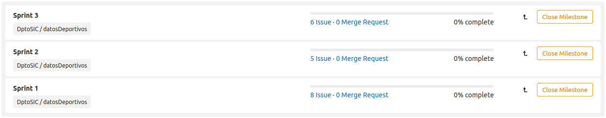
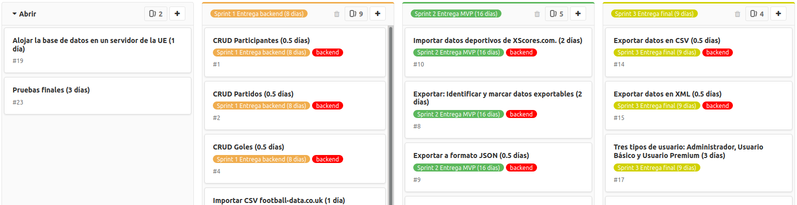
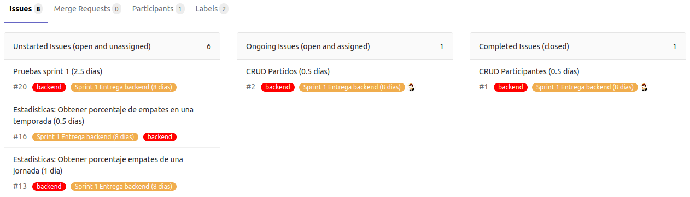
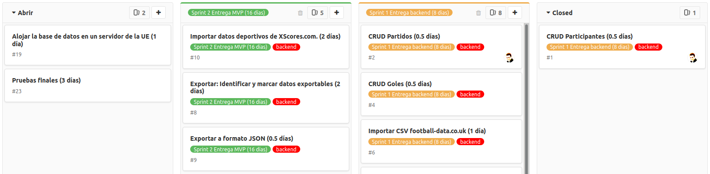

# Scrum

Para la fase de preproducción **nos basamos en Scrum**: sus eventos, roles y artefactos, aunque no seguimos Scrum por nuestras peculiaridades.

Se escoge Scrum porque es el marco de trabajo Agile más difundido y fácilmente nos haremos entender por otros agentes que intervengan en el desarrollo y no conozcan la forma de trabajar exacta en nuestro puesto de trabajo.

A veces lo más dificil de obtener parece en principio lo más simple: la mentalidad. Pero realmente cuesta, más teniendo en cuenta a lo que estamos acostumbrados actualmente en la Administración Pública: mucha burocracia, jerarquía, procesos "legacy", etc...

De la [guía de Scrum](https://scrumguides.org/docs/scrumguide/v2020/2020-Scrum-Guide-Spanish-European.pdf):  
_"Scrum es simple. Pruébalo tal cual y determine si su filosofía, teoría y estructura ayudan a alcanzar metas y crear valor. **El marco de Scrum es deliberadamente incompleto, solo define las partes necesarias para implementar la teoría de Scrum**. Scrum se basa en la inteligencia colectiva de las personas que lo utilizan. En lugar de proporcionar a las personas instrucciones detalladas, las reglas de Scrum guían sus relaciones e interacciones"_

La misma guía habla de su teoría:  
_Teoría de Scrum: Scrum **se basa en el empirismo y el pensamiento Lean**. El empirismo afirma que el conocimiento proviene de la experiencia y la toma de decisiones basadas en lo que se observa. El pensamiento Lean reduce los desperdicios y se centra en lo esencial._

## Eventos, Roles y Artefactos

Éste diagrama muestra cómo se ha estructurado Scrum para poder observar y mejorar el trabajo del equipo. Lo mejor es leerse la guía para tener claro qué se hace en cada evento, qué roles existen con sus responsabilidades y qué artefactos nos proporcionan control y contituyen el valor creciente del producto (ver un [resumen](https://www.youtube.com/watch?v=uMw6jMKhz0I&list=PL_4GjXD29UltPeqCXVBOl32lWBt5QKf_j&index=5) en formato webinar).

## Cómo ejecutarlo individualmente o en las pŕacticas del curso

Los cambios más importantes respecto a Scrum oficial son (ver guía si no se entiende algo):
1. El Equipo de Desarollo (ED) son los alumnos y normalmente se trabajará en pareja (no equipos de 3 a 9)
1. El Product Owner (PO) no existirá como tal. Se tendrá un DIM en la UCO como tutor y un Cliente. Si el DIM conoce el rol de PO sería la situación ideal. Debe quedarle claro en ese caso que él es el responsable de **La Pila**. En caso contrario **La Pila** deberá ser asumida por los alumnos con el apoyo del Scrum Master
1. El rol de Scrum Master (SM) será desarrollado por el Tutor-Profesor si no puede representarlo el Tutor-UCO (ver [normas de las prácticas](https://git.institutomilitar.com/Awes0meM4n/normas-dim/blob/master/normas/Normas%20Pr%C3%A1cticas.md)). Si el SM y el ED no están en la misma ubicación será dificil que participe en la Daily, con lo que debe mantenerse el contacto lo más estrecho posible. En el caso de que se pueda participar debe marcarse un horario lo más claro posible para que se realice

Hay que aprovechar al tutor asignado (o profesores antes de la subfase de prácticas) para que haga de SM. Lo normal es que tengamos muchas dudas así que debería ser habitual preguntarle.

El error más común a la hora de implementar es perder el foco:
1. Dedicar más tiempo del necesario a perfeccionar algo que ya alcanzó la DoD
1. Perderse entre opciones y pestañas buceando en google cuando se está haciendo una búsqueda
1. Prolongar la toma de una decisión por miedo a que sea equivocada
1. No preguntar al SM pensando que "esta tarde en casa lo arreglo"
1. Completar la duración de un Sprint con elementos de corta duración menos prioritarios que los del siguiente Sprint.

Nuestra mejor herramienta para no caer en estos errores es **La Pila** y su representación ordenada en un tablero tipo kanban. Tanto GitHub como GitEIE tienen la posibilidad con pequeñas diferencias entre ellos. Me centraré en [GitEIE](https://git.institutomilitar.com/) porque será lo empleado durante la subfase de prácticas:
1. Se debe planear cada incremento que pueda entregarse para recibir feedback. Con esas divisiones se agruparán los elementos de **La Pila** que satisfacen cada incremento en sendos Sprints utilizando los Hitos/Milestones.
1. Los elementos de **La Pila** que serán implementados en el MVP se cargarán como incidencias parecido a este modelo:  
    
1. Los milestones agrupan los elementos:
    
1. Este proceso automatiza una serie de tareas. Por ejemplo, los milestones se pueden visualizar en el tablero.
1. Así la prioridad de los elementos de **La Pila** viene establecida por el milestone al que pertenecen y dentro de cada milestone se ordenan los elementos por prioridad descendente en su columna:  
    
1. Es aconsejable que los elementos tengan visible de una forma fácil su esfuerzo en tiempo para ayudar a agruparlos, pero sin caer en la tentación de completar la duración de un Sprint con elementos menos prioritarios.

Por todo ello **es fundamental tener claro** el tablero de la última figura para saber en qué estoy trabajando y cuál es **"mi compromiso adquirido en la daily"**. Todo lo que no contribuya con esto último debe ser evitado. Nuestro compromiso seguirá un sistema de arrastre (como en [kanban](https://es.wikipedia.org/wiki/Kanban_(desarrollo))):
1. En la daily me asigno un elemento.
1. Cuando termino un elemento lo paso a la columna de completado. Es aconsejable completarlo haciendo un commit con la palabra `Fix #1` (donde `#1` es el identificador de la incidencia completada) el final del título del mensaje (en la rama apropiada).
    
1. Es importante añadir comentarios de valor a la incidencia para futuras consultas (también adjuntar cualquier archivo relevante como por ejemplo el resultado de un test).
1. GitLab es capaz de mantener actualizado nuestro tablero, los hitos y así mantenemos una documentación con un contexto adecuado (cualquier puede saber qué se hizo y por qué examinando el historial y los comentarios).
    

En general deberíamos tener la pila del sprint con las tareas superiores asignadas (Work In Progress - WIP) que deberían estar terminadas en la siguiente daily (porque los elemenos tienen una duración de 1 día o menos) y cuando se completan pasan a la última solumnas de incidencias cerradas. Se pueden crear otras columnas intermedias para otros estados (como por ejemplo pendiente de test de integración si hay dependencias de otras tareas).

Echa un vistazo a los pasos iniciales cargando la primera incidencia y viendo estos elementos en [video](https://www.youtube.com/watch?v=LbQkea_4wCI&list=PL_4GjXD29UltPeqCXVBOl32lWBt5QKf_j&index=6).